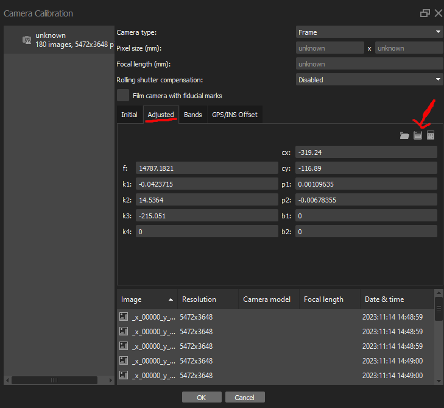
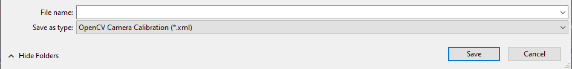
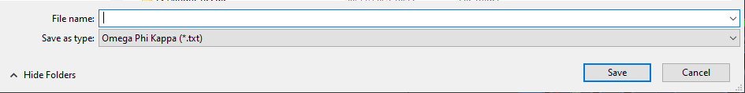
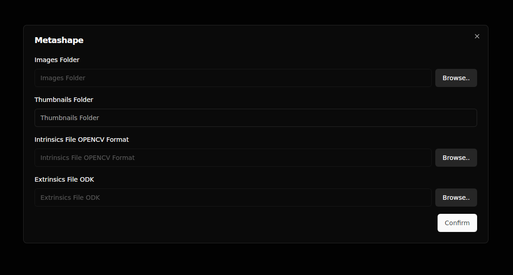
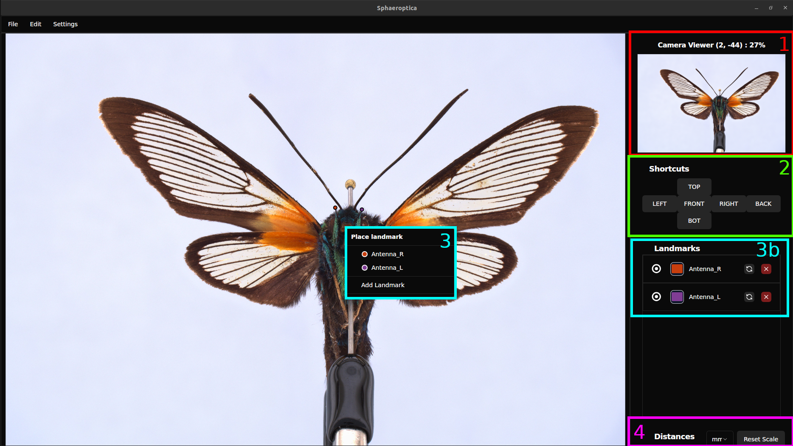

# SPHAEROPTICA

Desktop app for [Sphaeroptica](https://github.com/ypollet/Sphaeroptica-Frontend), developed thanks to [Wails](https://wails.io/)  
The first version of the app developed with QT is available [here](https://github.com/ypollet/Sphaeroptica-1)

Sphaeroptica is a 3D viewer of calibrated images.  
The viewer needs a sphere of images around the object.  
It is useful to digitize objects with fine details that a 3D model can't render properly.  

## 1. Create your own image sphere

To create an image sphere follow these steps:

1. Take pictures around the object with an automated device or simply a turning table and a camera. Take as much as you need to have the entire object.
	1. Optional : if needed (it is necessary for smaller specimen), pass your images to a focus stacker software to have a better resolution on your views 
2. Calibrate these images with a photogrammetry software. Right now, we only accept data from Agisoft Metashape but we are working on adding other free softwares as well

### Agisoft Metashape

#### Export Intrinsics
To export the intrinsic data from Metashape, select *Tools* -> *Camera Calibration*. As shown in the image below, make sure that you're in the adjusted tab, and click on the save button (indicated by the red arrow).
  

Then save the data in *OPENCV Camera Calibration* format :

#### Export Extrinsics
To export the extrinsic data from Metashape, select *File* -> *Export* -> *Export Cameras* and save the data in *Omega Phi Kappa* format :

## 2. Import your data to Sphaeroptica
Sphaeroptica will need the following information to create a project :
* The folder containing all the calibrated images
* The name of the folder with all the thumbnails (it will be in the image folder and created if it doesn't exists)
* The calibration data files as explained before

Example with Metashape :

## 3. Functionalities

The major functionalities of Sphaeroptica are the following :

1. Camera Viewer  
Drag your mouse on the camera viewer to rotate the object

2. Shortcuts to specified views  
Click on the buttons to display a specific view of the object

3. Triangulate a landmark  
Right click on the image to place (and create if needed) a landmark, you need to place it on 2 different images to be able to compute its 3D position.
The list of landmarks will be shown in ***3b***

4. Compute Distances  
Double click on 2 landmarks displayed in ***3b*** (they'll be purple) and as you right click, you can ask Sphaeroptica to compute the distance between these landmarks (and it will automatically update when you move either landmark)

## 4.  TODO

* Creating imports from COLMAP and RealityCapture
* Adding the 3D Model to the project for morphological studies 